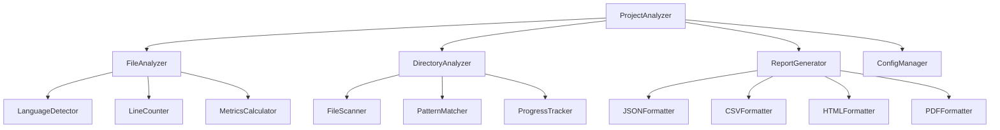

# Components Documentation

## Overview

This document provides detailed documentation for all reusable components in the cloc project. Each component is documented with its interface, props, events, and usage examples.

## Table of Contents

1. [Component Architecture](#component-architecture)
2. [Base Components](#base-components)
3. [Analysis Components](#analysis-components)
4. [UI Components](#ui-components)
5. [Utility Components](#utility-components)
6. [Testing Components](#testing-components)
7. [Component Guidelines](#component-guidelines)

---

## Component Architecture

### Component Hierarchy

```
ProjectAnalyzer (Root)
├── FileAnalyzer
│   ├── LanguageDetector
│   ├── LineCounter
│   └── MetricsCalculator
├── DirectoryAnalyzer
│   ├── FileScanner
│   ├── PatternMatcher
│   └── ProgressTracker
├── ReportGenerator
│   ├── JSONFormatter
│   ├── CSVFormatter
│   ├── HTMLFormatter
│   └── PDFFormatter
└── ConfigManager
    ├── ConfigValidator
    ├── ConfigLoader
    └── ConfigMerger
```

### Component Lifecycle

1. **Initialization**: Component is created with initial props/options
2. **Configuration**: Component loads and validates configuration
3. **Execution**: Component performs its primary function
4. **Cleanup**: Component releases resources and cleans up

---

## Base Components

### `BaseAnalyzer`

Abstract base class for all analyzer components.

#### Properties

```javascript
class BaseAnalyzer {
  constructor(options = {}) {
    this.options = this.validateOptions(options);
    this.cache = new Map();
    this.events = new EventEmitter();
  }
}
```

#### Methods

##### `validateOptions(options)`
Validates and normalizes component options.

```javascript
validateOptions(options) {
  const defaults = {
    cacheResults: true,
    ignoreHidden: true,
    maxFileSize: 10485760
  };
  
  return { ...defaults, ...options };
}
```

##### `emit(event, data)`
Emits events for component communication.

```javascript
emit(event, data) {
  this.events.emit(event, data);
}
```

##### `on(event, callback)`
Subscribes to component events.

```javascript
on(event, callback) {
  this.events.on(event, callback);
}
```

#### Events

- `start`: Emitted when analysis begins
- `progress`: Emitted during analysis with progress information
- `complete`: Emitted when analysis is finished
- `error`: Emitted when an error occurs

#### Example

```javascript
class CustomAnalyzer extends BaseAnalyzer {
  constructor(options) {
    super(options);
    this.name = 'CustomAnalyzer';
  }
  
  async analyze(input) {
    this.emit('start', { input });
    
    try {
      const result = await this.performAnalysis(input);
      this.emit('complete', { result });
      return result;
    } catch (error) {
      this.emit('error', { error, input });
      throw error;
    }
  }
}
```

---

## Analysis Components

### `FileAnalyzer`

Analyzes individual files for code metrics and statistics.

#### Constructor

```javascript
const analyzer = new FileAnalyzer({
  cacheResults: true,
  ignoreHidden: true,
  customPatterns: {},
  maxFileSize: 10485760
});
```

#### Options

| Option | Type | Default | Description |
|--------|------|---------|-------------|
| `cacheResults` | boolean | `true` | Whether to cache analysis results |
| `ignoreHidden` | boolean | `true` | Whether to ignore hidden files |
| `customPatterns` | object | `{}` | Custom language detection patterns |
| `maxFileSize` | number | `10485760` | Maximum file size to analyze (bytes) |

#### Methods

##### `analyze(filePath)`
Analyzes a single file and returns comprehensive metrics.

```javascript
const result = await analyzer.analyze('./src/main.js');
console.log(result);
// Output: {
//   file: './src/main.js',
//   language: 'JavaScript',
//   size: 1024,
//   lines: {
//     total: 150,
//     code: 120,
//     comments: 20,
//     blank: 10
//   },
//   complexity: {
//     cyclomatic: 15,
//     cognitive: 12,
//     halstead: { /* ... */ }
//   },
//   maintainability: {
//     index: 85,
//     rank: 'A'
//   }
// }
```

##### `getLanguage(filePath)`
Detects the programming language of a file.

```javascript
const language = analyzer.getLanguage('./script.py');
console.log(language); // 'Python'
```

##### `setCustomPattern(name, pattern)`
Adds or updates a custom language detection pattern.

```javascript
analyzer.setCustomPattern('Vue', {
  extensions: ['.vue'],
  commentPatterns: [/<!--[\s\S]*?-->/gm, /\/\/.*$/gm]
});
```

#### Events

- `file:start`: Emitted when file analysis begins
- `file:progress`: Emitted during file analysis
- `file:complete`: Emitted when file analysis is complete
- `file:error`: Emitted when file analysis fails

#### Example

```javascript
const analyzer = new FileAnalyzer({
  cacheResults: true,
  customPatterns: {
    'JSX': {
      extensions: ['.jsx'],
      commentPatterns: [/\/\/.*$/gm, /\/\*[\s\S]*?\*\//gm]
    }
  }
});

analyzer.on('file:start', ({ file }) => {
  console.log(`Starting analysis of ${file}`);
});

analyzer.on('file:complete', ({ file, result }) => {
  console.log(`Completed analysis of ${file}: ${result.lines.total} lines`);
});

const result = await analyzer.analyze('./src/component.jsx');
```

---

### `DirectoryAnalyzer`

Recursively analyzes directories and their contents.

#### Constructor

```javascript
const analyzer = new DirectoryAnalyzer({
  recursive: true,
  maxDepth: Infinity,
  exclude: [],
  include: [],
  followSymlinks: false
});
```

#### Options

| Option | Type | Default | Description |
|--------|------|---------|-------------|
| `recursive` | boolean | `true` | Whether to analyze subdirectories |
| `maxDepth` | number | `Infinity` | Maximum directory depth to analyze |
| `exclude` | array | `[]` | Array of patterns to exclude |
| `include` | array | `[]` | Array of patterns to include |
| `followSymlinks` | boolean | `false` | Whether to follow symbolic links |

#### Methods

##### `analyze(directoryPath)`
Analyzes a directory and all its contents.

```javascript
const result = await analyzer.analyze('./src');
console.log(result);
// Output: {
//   directory: './src',
//   totalFiles: 25,
//   totalSize: 1048576,
//   languages: {
//     JavaScript: { files: 20, lines: 4000, size: 800000 },
//     TypeScript: { files: 5, lines: 1000, size: 200000 }
//   },
//   fileTypes: {
//     '.js': 15,
//     '.jsx': 5,
//     '.ts': 3,
//     '.tsx': 2
//   }
// }
```

##### `scanFiles(directoryPath)`
Scans directory for files matching criteria.

```javascript
const files = await analyzer.scanFiles('./src');
console.log(files);
// Output: ['./src/index.js', './src/utils.js', ...]
```

##### `addExcludePattern(pattern)`
Adds a new exclude pattern.

```javascript
analyzer.addExcludePattern('*.test.js');
```

##### `addIncludePattern(pattern)`
Adds a new include pattern.

```javascript
analyzer.addIncludePattern('src/**/*.js');
```

#### Events

- `directory:start`: Emitted when directory analysis begins
- `directory:scan`: Emitted when scanning for files
- `directory:progress`: Emitted during directory analysis
- `directory:complete`: Emitted when directory analysis is complete

#### Example

```javascript
const analyzer = new DirectoryAnalyzer({
  recursive: true,
  maxDepth: 3,
  exclude: ['node_modules/**', '*.test.js'],
  include: ['src/**', 'lib/**']
});

analyzer.on('directory:progress', ({ processed, total }) => {
  console.log(`Progress: ${processed}/${total} files processed`);
});

const result = await analyzer.analyze('./my-project');
```

---

## UI Components

### `ProgressTracker`

Tracks and displays analysis progress.

#### Constructor

```javascript
const tracker = new ProgressTracker({
  showPercentage: true,
  showETA: true,
  updateInterval: 100
});
```

#### Options

| Option | Type | Default | Description |
|--------|------|---------|-------------|
| `showPercentage` | boolean | `true` | Whether to show percentage |
| `showETA` | boolean | `true` | Whether to show estimated time |
| `updateInterval` | number | `100` | Update interval in milliseconds |

#### Methods

##### `start(total)`
Starts tracking progress with a total count.

```javascript
tracker.start(100);
```

##### `update(current, message)`
Updates the current progress.

```javascript
tracker.update(50, 'Processing file 50 of 100');
```

##### `complete(message)`
Marks progress as complete.

```javascript
tracker.complete('Analysis complete!');
```

#### Example

```javascript
const tracker = new ProgressTracker({
  showPercentage: true,
  showETA: true
});

tracker.start(files.length);

for (let i = 0; i < files.length; i++) {
  await analyzeFile(files[i]);
  tracker.update(i + 1, `Analyzing ${files[i]}`);
}

tracker.complete('All files analyzed');
```

---

### `ReportGenerator`

Generates reports in various formats.

#### Constructor

```javascript
const generator = new ReportGenerator({
  format: 'json',
  outputPath: './reports',
  template: 'default'
});
```

#### Options

| Option | Type | Default | Description |
|--------|------|---------|-------------|
| `format` | string | `'json'` | Output format |
| `outputPath` | string | `'./reports'` | Output directory |
| `template` | string | `'default'` | Report template |

#### Methods

##### `generate(data, options)`
Generates a report from analysis data.

```javascript
const report = await generator.generate(analysisData, {
  format: 'html',
  filename: 'project-report.html'
});
```

##### `addTemplate(name, template)`
Adds a custom report template.

```javascript
generator.addTemplate('custom', {
  header: '<h1>{{title}}</h1>',
  body: '<div>{{content}}</div>',
  footer: '<p>Generated on {{date}}</p>'
});
```

#### Example

```javascript
const generator = new ReportGenerator({
  format: 'html',
  outputPath: './reports'
});

// Add custom template
generator.addTemplate('detailed', {
  header: '<html><head><title>{{title}}</title></head><body>',
  body: '<h1>{{title}}</h1><div>{{content}}</div>',
  footer: '</body></html>'
});

const report = await generator.generate(analysisData, {
  template: 'detailed',
  filename: 'detailed-report.html'
});
```

---

## Utility Components

### `ConfigManager`

Manages application configuration.

#### Constructor

```javascript
const config = new ConfigManager({
  configPath: './cloc.config.js',
  validateConfig: true,
  allowOverrides: true
});
```

#### Methods

##### `load()`
Loads configuration from file.

```javascript
const config = await configManager.load();
```

##### `merge(override)`
Merges override configuration.

```javascript
const merged = configManager.merge({
  exclude: ['*.test.js']
});
```

##### `validate(config)`
Validates configuration object.

```javascript
const isValid = configManager.validate(config);
```

#### Example

```javascript
const configManager = new ConfigManager({
  configPath: './cloc.config.js',
  validateConfig: true
});

const config = await configManager.load();
const overrideConfig = configManager.merge({
  outputFormat: 'html',
  exclude: ['*.test.js', 'node_modules/**']
});
```

---

### `CacheManager`

Manages caching of analysis results.

#### Constructor

```javascript
const cache = new CacheManager({
  maxSize: 1000,
  ttl: 3600000, // 1 hour
  storage: 'memory'
});
```

#### Methods

##### `get(key)`
Retrieves cached value.

```javascript
const cached = await cache.get('file:/path/to/file.js');
```

##### `set(key, value, ttl)`
Stores value in cache.

```javascript
await cache.set('file:/path/to/file.js', analysisResult);
```

##### `clear()`
Clears all cached values.

```javascript
await cache.clear();
```

#### Example

```javascript
const cache = new CacheManager({
  maxSize: 500,
  ttl: 1800000 // 30 minutes
});

// Check cache before analysis
const cached = await cache.get(`file:${filePath}`);
if (cached) {
  return cached;
}

// Analyze and cache result
const result = await analyzeFile(filePath);
await cache.set(`file:${filePath}`, result);
```

---

## Testing Components

### `TestRunner`

Runs tests for components and functions.

#### Constructor

```javascript
const runner = new TestRunner({
  testDir: './tests',
  timeout: 5000,
  parallel: true
});
```

#### Methods

##### `run(pattern)`
Runs tests matching pattern.

```javascript
const results = await runner.run('*.test.js');
```

##### `runSuite(suiteName)`
Runs a specific test suite.

```javascript
const results = await runner.runSuite('FileAnalyzer');
```

#### Example

```javascript
const runner = new TestRunner({
  testDir: './tests',
  timeout: 10000,
  parallel: false
});

const results = await runner.run('components/*.test.js');
console.log(`${results.passed} passed, ${results.failed} failed`);
```

---

## Component Guidelines

### Component Design Principles

1. **Single Responsibility**: Each component should have a single, well-defined purpose
2. **Composability**: Components should be composable and reusable
3. **Testability**: Components should be easy to test in isolation
4. **Event-Driven**: Use events for loose coupling between components
5. **Configuration**: Support flexible configuration options

### Component Structure

```javascript
class ComponentName extends BaseComponent {
  constructor(options = {}) {
    super(options);
    this.name = 'ComponentName';
    this.validateOptions(options);
  }
  
  // Public methods
  async publicMethod() {
    // Implementation
  }
  
  // Private methods
  _privateMethod() {
    // Implementation
  }
  
  // Static methods
  static create(options) {
    return new ComponentName(options);
  }
}
```

### Error Handling

```javascript
class ComponentName extends BaseComponent {
  async processFile(filePath) {
    try {
      this.emit('start', { file: filePath });
      const result = await this._analyzeFile(filePath);
      this.emit('complete', { file: filePath, result });
      return result;
    } catch (error) {
      this.emit('error', { file: filePath, error });
      throw new ComponentError(`Failed to process ${filePath}`, error);
    }
  }
}
```

### Testing Guidelines

```javascript
describe('ComponentName', () => {
  let component;
  
  beforeEach(() => {
    component = new ComponentName({
      option1: 'value1',
      option2: 'value2'
    });
  });
  
  afterEach(() => {
    component.cleanup();
  });
  
  it('should perform expected behavior', async () => {
    const result = await component.publicMethod();
    expect(result).toBeDefined();
  });
  
  it('should handle errors gracefully', async () => {
    await expect(component.publicMethod('invalid')).rejects.toThrow();
  });
});
```

### Documentation Requirements

For each component, provide:

1. **Purpose**: What the component does
2. **Constructor**: Parameters and options
3. **Methods**: All public methods with parameters and return values
4. **Events**: All events emitted by the component
5. **Examples**: Working code examples
6. **Error Handling**: How errors are handled
7. **Testing**: How to test the component

---

## Component Registry

### Available Components

| Component | Purpose | Status |
|-----------|---------|--------|
| `FileAnalyzer` | Analyzes individual files | ✅ Stable |
| `DirectoryAnalyzer` | Analyzes directories | ✅ Stable |
| `LanguageDetector` | Detects programming languages | ✅ Stable |
| `LineCounter` | Counts lines of code | ✅ Stable |
| `MetricsCalculator` | Calculates code metrics | 🚧 Beta |
| `ReportGenerator` | Generates reports | ✅ Stable |
| `ConfigManager` | Manages configuration | ✅ Stable |
| `CacheManager` | Manages caching | ✅ Stable |
| `ProgressTracker` | Tracks progress | ✅ Stable |
| `TestRunner` | Runs tests | 🚧 Beta |

### Component Dependencies



---

*This documentation is automatically generated from component source code. Last updated: $(date)*